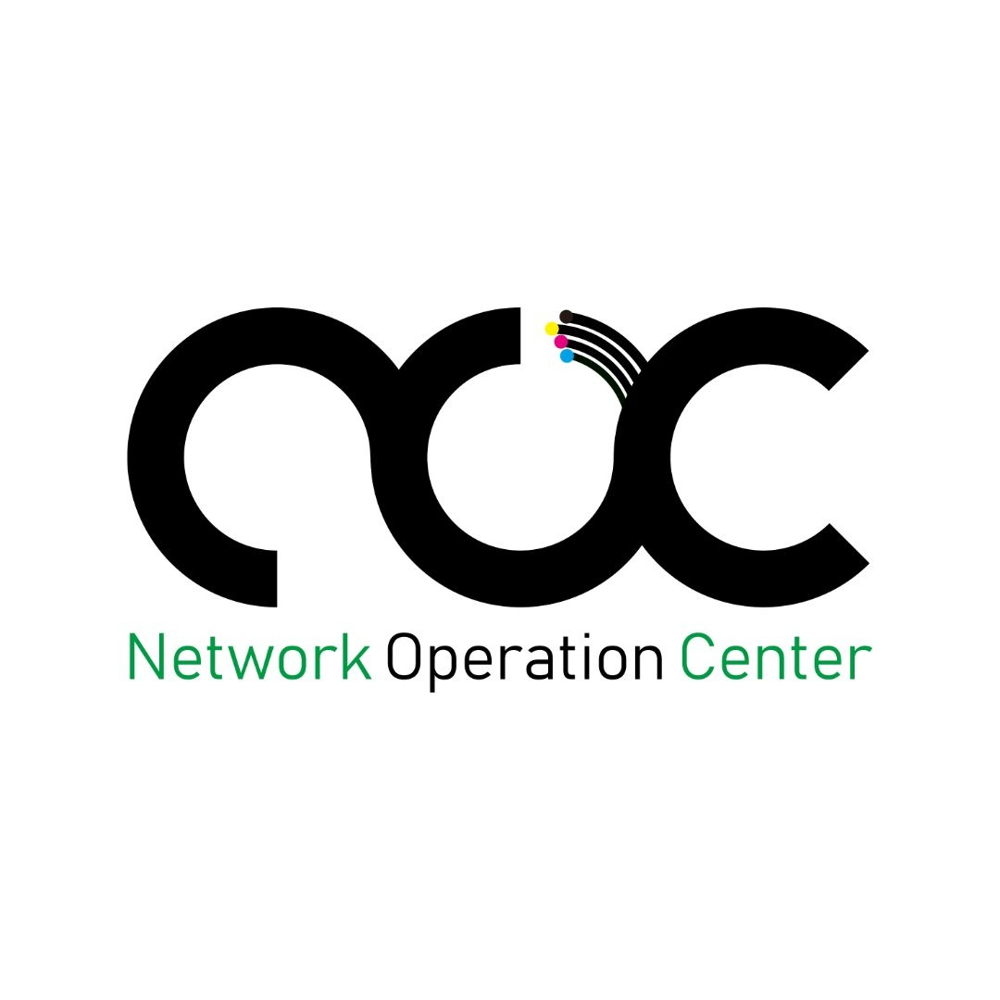

# ERP NOC - SMKN 4 Malang

  

## Deskripsi Singkat
Sistem yang dikembangkan merupakan sistem informasi inventory berbasis ERP yang digunakan untuk mengelola data inventaris di **NOC SMKN 4 Malang**. Sistem ini dirancang berbasis web agar dapat diakses dengan mudah oleh pengguna sesuai perannya. Fitur utama yang tersedia meliputi pengelolaan barang, peminjaman, manajemen aset, sistem persetujuan, serta pelaporan. Dengan adanya sistem ini, diharapkan proses pengelolaan inventaris menjadi lebih terstruktur, efisien, dan transparan, serta meminimalkan kesalahan dalam pencatatan data.

## Analisis Profil Klien
NOC (Network Operation Center) SMKN 4 Malang merupakan bagian yang bertanggung jawab dalam pengelolaan perangkat jaringan dan inventaris teknologi yang digunakan di lingkungan sekolah. NOC memiliki peran penting dalam memastikan ketersediaan, kondisi, serta distribusi perangkat seperti router, switch, kabel, dan peralatan pendukung lainnya. Selain itu, NOC juga mendukung kegiatan pembelajaran dan praktikum dengan menyediakan fasilitas peminjaman alat bagi siswa maupun pihak terkait.

## Dokumentasi Permasalahan
Permasalahan yang dihadapi dalam pengelolaan inventaris di NOC saat ini adalah:
- **Pencatatan Manual**: Proses pencatatan masih dilakukan secara manual sehingga berpotensi menimbulkan kesalahan dan ketidaksesuaian data.
- **Kurangnya Sentralisasi**: Belum adanya sistem terpusat menyebabkan kesulitan dalam memantau stok, kondisi barang, serta riwayat peminjaman.
- **Pelacakan yang Sulit**: Proses peminjaman belum terdokumentasi dengan baik, sehingga menyulitkan dalam melakukan pelacakan penggunaan barang dan mengurangi transparansi.

## Analisis Kebutuhan Pengguna
Berikut beberapa kebutuhan sistem yang diperlukan untuk mendukung pengelolaan inventaris di NOC:

### 1. Pengelolaan Barang
- Sistem mampu mencatat data barang secara lengkap (nama, kategori, kondisi, asal barang).
- Menyediakan informasi stok barang secara akurat dan real-time.

### 2. Peminjaman Barang
- Admin dapat melakukan pengajuan peminjaman barang melalui sistem.
- Sistem mencatat data peminjaman dan pengembalian secara otomatis.

### 3. Sistem Persetujuan
- Superadmin melakukan validasi terhadap peminjaman barang.
- Proses persetujuan dilakukan secara digital dan tercatat.

### 4. Manajemen Aset dan Kondisi
- Sistem dapat mencatat kondisi barang (baik/rusak).
- Tersedia fitur pencatatan perawatan atau perbaikan barang.

### 5. Laporan dan Monitoring
- Menyediakan laporan stok barang, peminjaman, dan barang keluar/masuk.
- Memudahkan monitoring penggunaan barang.

## Hak Akses Pengguna
- **Superadmin**: Mengelola sistem dan memvalidasi peminjaman.
- **Admin**: Mengelola data barang dan melakukan peminjaman.

---

## Spesifikasi Teknis
- **Framework**: Laravel 13.x
- **PHP Version**: ^8.3
- **Frontend**: Vite, Blade, Tailwind CSS / Vanilla CSS

## Lisensi
The Laravel framework is open-sourced software licensed under the [MIT license](https://opensource.org/licenses/MIT).
