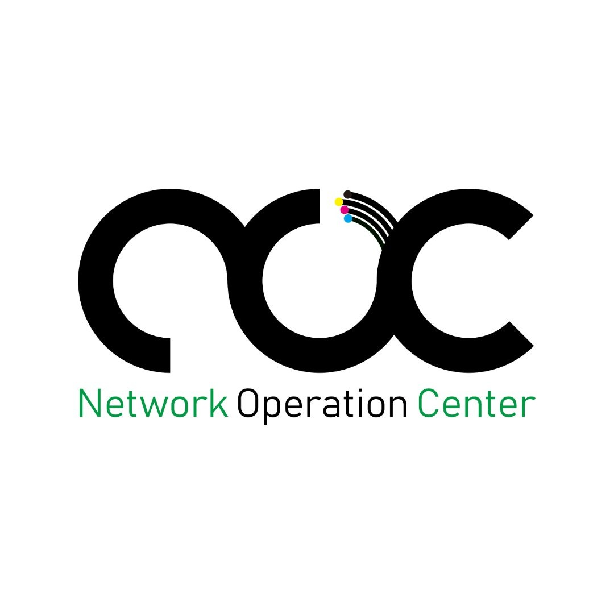

# ERP NOC - SMKN 4 Malang

<p align="center">
  
</p>

<p align="center">
  <a href="#"></a>
  <a href="#"></a>
  <a href="#"></a>
  <a href="#"></a>
  <a href="#"></a>
</p>

## Daftar Isi
- [Deskripsi Singkat](#deskripsi-singkat)
- [Profil Klien](#analisis-profil-klien)
- [Permasalahan](#dokumentasi-permasalahan)
- [Fitur Unggulan](#fitur-unggulan-sistem)
- [Hak Akses Pengguna](#hak-akses-pengguna)
- [Struktur Menu Utama](#struktur-menu-utama)
- [Spesifikasi Teknis](#spesifikasi-teknis)
- [Cara Instalasi & Konfigurasi](#cara-instalasi--konfigurasi)
- [Panduan Repository & Git](#panduan-repository--git)
- [Catatan Rilis (Changelog)](#catatan-rilis-changelog)
- [Lisensi](#lisensi)

---

## Deskripsi Singkat
Sistem **ERP (Enterprise Resource Planning)** Inventory berbasis web yang dikembangkan khusus untuk mengelola data inventaris di **NOC SMKN 4 Malang**. Sistem ini dirancang agar pengelolaan inventaris perangkat jaringan, alat praktikum, dan aset teknologi menjadi lebih **terstruktur, efisien, akurat, dan transparan**.

Fitur utama mencakup pengelolaan master data barang, sistem peminjaman via QR Code, tracking pergerakan barang, perawatan aset, monitoring real-time, serta laporan yang dapat diekspor dalam format profesional.

---

## Analisis Profil Klien
NOC (Network Operation Center) SMKN 4 Malang adalah unit yang bertanggung jawab dalam **pengelolaan perangkat jaringan, infrastruktur, dan inventaris teknologi** di lingkungan sekolah. Peran utama NOC antara lain:
- Memastikan ketersediaan dan kondisi prima perangkat (router, switch, access point, kabel, dll).
- Mendukung kegiatan pembelajaran & praktikum siswa melalui penyediaan alat pinjam.
- Mencatat distribusi, perawatan, dan penghapusan aset secara periodik.

---

## Dokumentasi Permasalahan
Permasalahan inventaris NOC sebelum sistem ini diterapkan:
- **Pencatatan Manual**: Beresiko tinggi terhadap human error, duplikasi data, dan inkonsistensi laporan.
- **Kurangnya Sentralisasi**: Data tersebar di banyak tempat sehingga monitoring stok, kondisi barang, dan riwayat pinjam sulit dilakukan.
- **Pelacakan Minim**: Riwayat penggunaan barang dan peminjaman tidak terdokumentasi dengan baik → sulit audit dan tracing.
- **Tidak Ada Alert Proaktif**: Stok menipis, barang rusak, dan pinjaman terlambat tidak memberikan peringatan otomatis.

---

## Fitur Unggulan Sistem

### 1. Dashboard Real-Time
- Statistik ringkasan aset, peminjaman aktif, barang masuk/keluar.
- **Grafik volume transaksi 30 hari terakhir** (data asli dari database, bukan dummy).
- **Sistem Alert Kesehatan**: Stok menipis, pinjaman terlambat, barang rusak berat, maintenance lama.
- Info sinkronisasi data terakhir dan status kesehatan sistem.

### 2. Master Data (Data Terpusat)
- **Data Kategori Barang, Ruangan/Lokasi, Supplier, Asal Barang, Jurusan, Kondisi Barang**
- **Data Pengguna / User Management** dengan role-based access.

### 3. Inventaris Barang
- CRUD barang lengkap: Kode unik otomatis (format `INV-[prefix]-[nomor]`), foto, serial number, merek, model.
- Pelacakan kondisi (`baik` / `rusak_ringan` / `rusak_berat` / `hilang`) dan status (`tersedia` / `dipinjam` / `maintenance` / `dimusnahkan`).
- Scan **QR Code** pada setiap barang untuk identifikasi cepat.

### 4. Peminjaman & Pengembalian
- **Peminjaman via QR Scan** (token sesi) untuk mempercepat proses.
- Form peminjaman manual (nama peminjam, kelas, tanggal pinjam/kembali).
- Tracking status pinjaman: **Dipinjam / Dikembalikan**.
- Catatan kondisi saat pengembalian, foto bukti, dan keterangan.
- **Alert otomatis pinjaman terlambat** (> 7 hari).

### 5. Pergerakan Barang (Barang Masuk / Keluar / Pindah / Maintenance)
- Log pergerakan perubahan lokasi, jumlah barang, kondisi, dan petugas yang menangani.
- Jenis transaksi: `masuk` / `keluar` / `pindah` / `maintenance` / `rusak` / `musnahkan`.

### 6. Data Perawatan Aset
- Pencatatan jadwal dan riwayat perawatan rutin.
- Biaya perawatan, vendor, dan catatan teknis.

### 7. Monitoring Akses
- **Access Log** (Riwayat login & aktivitas pengguna).

### 8. Laporan Lengkap & Profesional
Fitur ekspor di **Hub Laporan Utama**:
| Jenis Laporan | Format yang Tersedia |
|---|---|
| Ringkasan Aktivitas Dashboard | PDF / Print |
| Laporan Lengkap (5 sheet) | Excel (.xlsx, Multi-Sheet) |
| Daftar Inventaris Barang | CSV / PDF |
| Log Peminjaman | CSV / PDF |
| Barang Masuk | CSV / PDF |
| Barang Keluar | CSV / PDF |

**Template Laporan Formal & Profesional:**
- ✅ Kop Surat SMKN 4 Malang
- ✅ Nomor dokumen otomatis
- ✅ Kolom Tanda Tangan Kepala Sekolah & Kepala Lab
- ✅ Ukuran kertas A4 (Portrait/Landscape sesuai kebutuhan)

### 9. Pengaturan Profil
- Pengguna dapat mengubah foto profil (**sinkron dengan ikon di header**), password, dan data pribadi.

---

## Hak Akses Pengguna

| Fitur | Superadmin | Admin |
|---|:---:|:---:|
| Dashboard & Statistik | ✅ | ✅ |
| Kelola Data Master | ✅ | ✅ |
| Kelola Barang (CRUD) | ✅ | ✅ |
| Peminjaman & Pengembalian | ✅ | ✅ |
| **Hapus User / Atur Role** | ✅ | ❌ |
| **Ekspor Semua Laporan** | ✅ | ✅ |
| **Pengaturan Sistem** | ✅ | ❌ |
| **Hapus Akun Paten (superadmin/admin)** | ❌ | ❌ |

---

## Struktur Menu Utama
```
📊 Dashboard
📦 Inventaris Barang
  ├─ Daftar Barang
  ├─ Barang Masuk
  └─ Barang Keluar
📝 Data Peminjaman & Pengembalian
🔧 Data Perawatan
📚 Data Master
  ├─ Kategori Barang
  ├─ Lokasi / Ruangan
  ├─ Supplier
  ├─ Asal Barang
  ├─ Jurusan
  ├─ Kondisi Barang
  └─ Data User
📈 Laporan (Export CSV / PDF / Excel)
⚙️ Pengaturan (Profile & Sistem)
🖥️ QR Admin Panel
🕵️ Access Log (Superadmin)
```

---

## Spesifikasi Teknis
- **Framework**: Laravel 13.x
- **PHP Version**: ^8.3
- **Frontend Stack**: Vite, Blade Template, **Tailwind CSS**, Vanilla JS, Lucide Icons, Material Symbols
- **Database**: MySQL / MariaDB
- **Fitur Tambahan**:
  - **QR Code** untuk setiap barang dan sesi scan peminjaman
  - **AJAX Operations** (delete tanpa refresh halaman, dll)
  - **Custom Alert Modal** (bukan alert browser standar)
  - **Role Middleware** (`role:Superadmin,Admin`)

---

## Cara Instalasi & Konfigurasi

### 1. Clone Repository
```bash
git clone https://github.com/username/erp-noc-smkn4malang.git
cd erp-noc-smkn4malang
```

### 2. Install Dependency
```bash
composer install
npm install
```

### 3. Setup Environment
```bash
cp .env.example .env
# Edit .env, sesuaikan konfigurasi:
# - DB_HOST, DB_PORT, DB_DATABASE, DB_USERNAME, DB_PASSWORD
# - APP_URL
```

### 4. Generate Key & Jalankan Migrasi
```bash
php artisan key:generate
php artisan migrate --seed
```

### 5. Build Asset & Jalankan Server
```bash
npm run build        # atau npm run dev untuk development
php artisan serve
```

### 6. Login Awal
Sesuaikan user default di seeder (`database/seeders/ERPSeeder.php` atau `NocSeeder.php`).

---

## Panduan Repository & Git
### ⛔ File / Folder YANG TIDAK BOLEH di Push (Sudah di .gitignore)
- **Semua arsip** (`*.zip`, `*.rar`, `*.7z`, `*.tar.gz`, `project.zip.*`)
- **File utility / deploy PHP** (bukan bagian Laravel): `buat_zip.php`, `unzip.php`, `extract.php`, `check_error.php`, `generate_key.php`, `public/setup.php`, `public/update.php`, `public/migrate.php`, `public/fix-*.php`, `public/mod-db.php`
- **Script eksternal**: Semua `*.py`, `*.bat`, `*.sh`, `*.ps1`
- **Dump SQL**: Semua `*.sql` (mis. `database/erp_noc_smkn4malang.sql`)
- **File backup**: Semua `*.bak`, `*.backup`, `*.tmp`
- **Dokumen panduan lokal**: `PANDUAN_*.md`, `*_NOTES.md`, credential files
- **Diagram kerja**: `*.puml`, `*.plantuml`, `*.drawio`
- **Folder duplikat**: `/asset/` di root (hanya pakai `/public/asset/`)
- **Vendor dan asset build**: `/vendor`, `/node_modules`, `/public/build`
- **Environment & IDE**: `.env*`, `.vscode`, `.idea`, `.cursor`, `.DS_Store`, `Thumbs.db`

### ✅ Yang Boleh di Commit
- Semua source code framework: `app/`, `bootstrap/`, `config/`, `database/migrations/`, `database/seeders/`, `public/` (kecuali file deploy/fix), `resources/` (kecuali .bak), `routes/`, `tests/`
- Konfigurasi root: `composer.json`, `package.json`, `vite.config.js`, `artisan`, `.env.example`, `phpunit.xml`, `README.md`
- Asset resmi di `/public/asset/`, `/public/images/`, `/public/js/`, `/public/css/`

---

## Catatan Rilis (Changelog)

### [v1.1.0] - 2026-08-10
#### ✨ Fitur Baru / Peningkatan
- **Grafik Volume Transaksi 30 Hari** sekarang menggunakan **data real** dari database (agregasi `ItemMovement` + `Peminjaman` per hari) dengan indikator warna cerdas: hari ini, ≥ rata-rata, < rata-rata.
- **Alert Sistem Dinamis**:
  - Item stok menipis (threshold dinamis: consumable ≤ 10, aset umum ≤ 3) + preview nama item real.
  - Tindakan pending: pinjaman terlambat (>7h), barang rusak berat, maintenance lama (>14h).
  - Status sinkronisasi data terakhir (ambil max `updated_at` dari 5 tabel vital).
  - **Badge kesehatan sistem** (Aman / Alert / Kritis) di header panel.
- **Template Laporan Profesional** (5 template): Ringkasan, Inventaris, Peminjaman, Barang Masuk, Barang Keluar → dilengkapi Kop Surat, Nomor Dokumen, Kolom TTD Resmi.
- **Delete Tanpa Refresh**: Operasi hapus di Data User, Jurusan, Supplier, dll menggunakan AJAX + soft refresh tabel (nomor urut, pagination, total data sinkron otomatis).
- **Sinkronisasi Foto Profil**: Perubahan avatar di halaman profil langsung merefleksikan ikon di header.

#### 🔧 Perbaikan & Optimasi
- Optimasi layout halaman **Laporan** agar lebih padat (minim scroll) tanpa merusak keterbacaan.
- Perbaikan **z-index dropdown export** (`z-10`, bukan `z-50`) agar berada di bawah header/topbar.
- Perbaikan dan penyusunan ulang `.gitignore` + **untrack 26+ file** (ZIP, PHP deploy, Python, SQL dump, diagram, panduan lokal) yang tidak relevan dengan framework.

### [v1.0.0] - Sebelumnya
- Rilis awal sistem dengan fitur CRUD dasar, peminjaman via QR, dan laporan CSV sederhana.

---

## Kontribusi
Untuk berkontribusi:
1. Fork repository
2. Buat feature branch (`git checkout -b feature/xyz`)
3. Commit perubahan (`git commit -m 'Menambahkan fitur xyz'`)
4. Push ke branch (`git push origin feature/xyz`)
5. Buat Pull Request

---

## Lisensi
The Laravel framework is open-sourced software licensed under the [MIT license](https://opensource.org/licenses/MIT).

© 2026 — Dibangun untuk **NOC SMK Negeri 4 Malang**.
